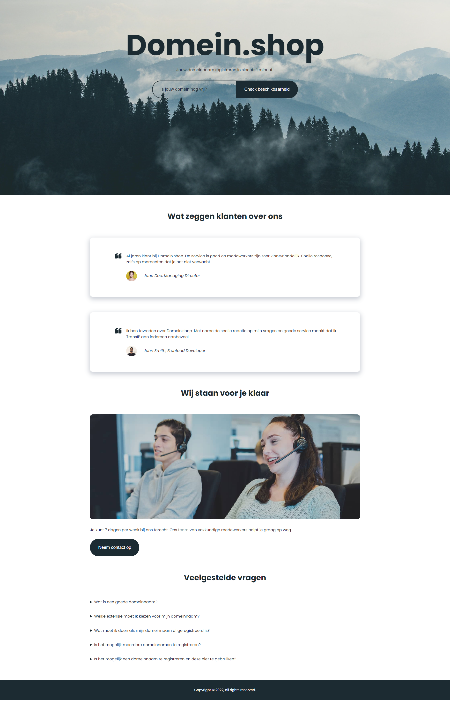
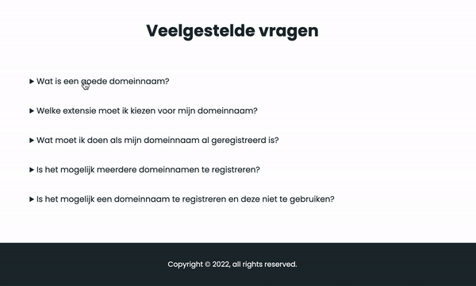

# Opdrachtomschrijving
Via via krijg je een klus aangeboden om de website voor een hosting provider te bouwen. Gelukkig heb je inmiddels voldoende geleerd om een simpele layout te maken. Je hoeft je nog niet druk te maken over optimalisatie voor mobiele devices. Dat mag van de opdrachtgever in een later stadium gedaan worden.

Je gaat de pagina opbouwen met verschillende HTML elementen en de opmaak verzorgen met diverse CSS properties. Benieuwd welke er allemaal zijn?
Je vindt hier een overzicht van alle [HTML elementen](https://www.w3schools.com/TAgs/default.asp) en hier een overzicht van alle [CSS properties](https://www.w3schools.com/cssref/). Het werkt altijd beter om even te spieken bij een werkend voorbeeld, dan om "maar wat te proberen" uit je hoofd!

Je kunt deze opdracht maken door het project te clonen of te downloaden naar jouw eigen computer via deze GitHub repository. Mocht je nou geen zin hebben om te typen: onderaan deze README vind je alle selecteerbare dummy-tekst voor deze opdracht.

## Inhoudsopgave
1. [Eindresultaat](#eindresultaat)
2. [Randvoorwaarden](#randvoorwaarden)
3. [Stappenplan](#stappenplan-en-richtlijnen)
4. [Dummytekst](#dummytekst)

## Eindresultaat

## Randvoorwaarden
* Je gebruikt HTML én CSS!
* We hebben alvast een handige structuur voor je klaargezet in het CSS-bestand. Probeer bij het schrijven van de CSS alles direct op de goede plek in te voegen, zodat het netjes en overzichtelijk blijft.
* Gebruik voor deze opdracht de stof die je op EdHub hebt gezien en gelezen.
* Je gebruikt de afbeeldingen uit de `assets` map.

## Stappenplan en richtlijnen

### 1.1 Projectopzet
Zorg er eerst voor dat de volgende basis-concepten in orde zijn:
- [ ] Vervang de placeholder-titel door `Domein.shop`, zodat dit bovenaan het tabblad in de browser staat;
- [ ] Koppel het CSS-bestand aan `index.html`;
- [ ] Zet alvast drie semantische elementen (`<header>`-, `<main>`- en `<footer>`) klaar in de body van het HTML-bestand, zodat het duidelijk is hoe de pagina in stukjes verdeeld gaat worden;
- [ ] Voorzie jouw CSS-bestand van een complete CSS-reset;
- [ ] Zet de kleuren (grijs #899CA0 en donkergroen #1C2B32) alvast in commentaar bovenaan het bestand, zodat je ze gemakkelijk kunt kopiëren;
- [ ] Het gebruikte lettertype in het design is _"Poppins"_. Dit font kun je gratis vinden op Google Fonts. Importeer dit in jouw CSS-bestand en stel de font-family voor de gehele webpagina in. 

### 1.2 Header
- [ ] Voeg de titel, tekst en het formulier als HTML toe aan de header. Zorg er hierbij voor dat het uiterlijk van de tekst overeenkomt met voorbeeld;
- [ ] Zet de content in de header netjes bij elkaar in een groep, door bijvoorbeeld een `div` te gebruiken. De groep mag maximaal 1000 pixels breed zijn. Zet de groep netjes in het midden van de pagina door de juiste `margin` te gebruiken. Zorg ook voor wat extra ruimte aan de boven en de onderkant met behulp van `padding`;
- [ ] Zorg ervoor dat het invoerveld en button er uit komen te zien als het voorbeeld, door gebruik te maken van de `border-radius`-property op de juiste hoeken. _Tip:_ je kunt deze elementen tegen elkaar aan krijgen door een negatieve margin (bijvoorbeeld: `margin: -1px;`) te gebruiken op één van de elementen. Dit is geen _best practise_, maar in dit geval de enige oplossing.

Zoals je kunt zien staat er een mooie afbeelding in de header. Maar we gaan je alvast verklappen dat deze niet is ingevoegd als ``-element! Wanneer je een afbeelding wil gebruiken in een header (of als achtergrond van de pagina) is het gebruikelijk om deze als _achtergrond-afbeelding_ in te voegen met CSS. Dit zorgt ervoor dat de afbeelding altijd de gehele header bedekt.

- [ ] Gebruik de afbeelding `mountains.jpg` als achtergrond-afbeelding, doormiddel van de `background-image`-property. Bekijk [hier](https://developer.mozilla.org/en-US/docs/Web/CSS/background-image) een werkend voorbeeld van deze property. Vervolgens kun je de [background-size](https://developer.mozilla.org/en-US/docs/Web/CSS/background-size) en de [background-position](https://developer.mozilla.org/en-US/docs/Web/CSS/background-position)-property gebruiken om de afbeelding netjes de header te laten bedekken.

### 1.3 Main gedeelte van de pagina
- [ ] Voor je aan de slag gaat met alle content in het `<main>`-gedeelte van de webpagina, is het belangrijk om het main element eerst even goed in te stellen, zodat alle content op dezelfde afstand van de rand komt te staan. Geef het `<main>`-element een maximale breedte van 1000px en plaats het in het midden met de juiste `margin`;
- [ ] Hoeveel sections kun jij herkennen in het voorbeeld? Zet deze `<section>`-elementen klaar in het `<main>`-element en zet de bijbehorende titels erbij. Voorzie de `<section>`-elementen van een heldere class-naam, zodat je ze goed uit elkaar kunt houden in de styling. Maak de titels zo op dat ze eruitzien als op het voorbeeld;
- [ ] Voor nu mag je de eerste section even laten voor wat het is. Voeg in de section daarna ("Wij staan voor je klaar") de afbeelding `callcenter.jpg` in (dit keer wel als ``-element!) en geef deze afgeronde hoeken. _Tip:_ afbeelding te groot? Zet 'm op `100%`, dan wordt hij niet groter dan het element waar hij in staat;
- [ ] De link in de tekst moet wijzen naar de pagina `team.html`. Geef links een grijze kleur met een lijntje eronder. Dit lijntje moet verdwijnen wanneer de gebruiker er met de muis overheen hovert. _Tip:_ Zorg ervoor dat je de styling van jouw linkjes op globale wijze beschrijft.
- [ ] Voorzie de button van styling zodat deze er zo uitziet als het voorbeeld. Check of alles er nogsteeds goed uitziet als je de buttontekst ineens heel lang maakt.

### 1.4 Veelgestelde vragen

- [ ] De veelgestelde vragen kunnen worden uitgeklapt! Hier gebruiken we het speciale `
`-element voor, wat het in- en uitklappen voor ons regelt. Bekijk [hier](https://developer.mozilla.org/en-US/docs/Web/HTML/Element/details) hoe je deze kunt gebruiken;
- [ ] Gebruik de juiste styling om de vragen er net zo uit te laten zien als in het voorbeeld;
- [ ] Zorg ervoor dat de muis veranderd in een `pointer`, wanneer de gebruiker er overeen hovert.

### 1.5 Testimonials
Oké, terug naar onze eerste section ("Wat klanten zeggen over ons");
- [ ] Laten we beginnen met de twee witte vlakken. Welke elementen lijken jou daarvoor geschikt? Zorg ervoor dat beide elementen een schaduw krijgen en over de gehele breedte spannen. Oh, en zorg ervoor dat ze niet tegen elkaar aangedrukt staan!
- [ ] Plaats de tekst in de witte vlakken en zorg dat er voldoende ruimte tussen de tekst en het eind van het witte vlak ontstaat;
- [ ] De afbeelding en naam van de auteur moeten samen in een groepje komen te staan. Welk element lijkt jou daarvoor geschikt?
- [ ] Maak de afbeeldingen 44 pixels bij 44 pixels groot. Maak er vervolgens cirkels van, door de juiste `border-radius` te gebruiken. Om de afbeelding en de naam nu vervolgens naast elkaar te krijgen in plaats van onder elkaar, zul je iets moeten doen met de [display](https://developer.mozilla.org/en-US/docs/Web/CSS/display)-property van de naam;
- [ ] _Tip:_ wil je ze netjes uitlijnen met de tekst? Spiek dan eens bij de [vertical-align](https://developer.mozilla.org/en-US/docs/Web/CSS/vertical-align)-property!
- [ ] Ten slotte is het tijd om het `quote`-teken in te voegen. Deze afbeelding kun je vinden in de map `assets`. Om het element op de juiste plek te krijgen, heb je de `position`-property nodig. _Positioneer deze afbeelding tenopzichte van het witte vlak._ Het helpt om de tekst wat extra padding te geven zodat deze ruimte maakt voor het quote-teken.

### 1.6 Footer
... Deze laten we aan jou over! ;)

## Dummytekst
> ## Domein.shop
> Jouw domeinnaam registreren in slechts 1 minuut!

> Is jouw domein nog vrij?
>
> Check beschikbaarheid
-------------------------------------------------------------------------
> ## Wat zeggen klanten over ons
> Al jaren klant bij Domein.shop. De service is goed en medewerkers zijn zeer klantvriendelijk. Snelle response, zelfs op momenten dat je het niet verwacht.
>
> Jane Doe, Managing Director
>
> Ik ben tevreden over Domein.shop. Met name de snelle reactie op mijn vragen en goede service maakt dat ik TransIP aan iedereen aanbeveel.
>
> John Smith, Frontend Developer

-------------------------------------------------------------------------
> ## Wij staan voor je klaar
> Je kunt 7 dagen per week bij ons terecht. Ons team van vakkundige medewerkers helpt je graag op weg.
>
> Neem contact op
-------------------------------------------------------------------------
> ## Veelgestelde vragen
> - Wat is een goede domeinnaam?
>
> Een goede domeinnaam moet aan enkele eisen voldoen. Ten eerste mag jouw domeinnaam niet in strijd zijn met de openbare orde of de goede zeden. Dit betekent dat je geen ongepaste domeinnaam mag registreren. Verder mag een domeinnaam enkel uit letters, cijfers en eventueel een liggend streepje bestaan. Andere leestekens zijn niet toegestaan.
>
> - Welke extensie moet ik kiezen voor mijn domeinnaam?
>
> Je mag helemaal zelf kiezen welke extensie jouw domeinnaam krijgt. Dit kan een .nl-extensie zijn, maar ook een .be-extensie, een .de-extensie of een .com-extensie. Vraag jezelf af op welke markt je je gaat richten, in het heden én in de toekomst. Ben je niet van plan je business de grens over te brengen? Dan heb je eigenlijk alleen een .nl-domeinnaam nodig. Je kunt andere extensies registreren om te voorkomen dat anderen dit doen, maar deze domeinnamen ga je waarschijnlijk niet zelf gebruiken.
>
> - Wat moet ik doen als mijn domeinnaam al geregistreerd is?
>
> Is de domeinnaam die jij wil registreren, al geregistreerd door iemand anders? Dan kun je deze niet opnieuw registreren. Jouw domeinnaam moet namelijk uniek zijn. Als je gewenste domeinnaam al geregistreerd is, heb je twee mogelijkheden. Ten eerste kun je ervoor kiezen een alternatieve domeinnaam te registreren. Dit kan een domeinnaam zijn die op jouw eerste keuze lijkt, maar ook een heel ander domein. Je vindt vanzelf wel een goede domeinnaam die nog vrij is.
>
> - Is het mogelijk meerdere domeinnamen te registreren?
>
> Ja, het is zeker mogelijk meerdere domeinnamen te registreren. Als je zou willen, kun je wel tientallen domeinnamen registreren. Houd er wel rekening mee dat iedere domeinnaam die je registreert, geld kost. Hoe meer domeinnamen je registreert, des te meer geld je moet betalen voor deze domeinen.
>
> - Is het mogelijk een domeinnaam te registreren en deze niet te gebruiken?
>
> Ja, je kunt een domeinnaam registreren zonder deze te gebruiken. Dit gebeurt regelmatig. Ten eerste zijn er veel ondernemers die de domeinnaam van hun nieuwe bedrijf alvast registreren, terwijl ze nog lang geen website hebben. Zij willen simpelweg zeker weten dat de domeinnaam nog beschikbaar is als hun website af is en registreren deze daarom alvast. Verstandig, zeker als je een domeinnaam wil registreren die andere mensen ook interessant kunnen vinden.
>
-------------------------------------------------------------------------
> Copyright © 2022, all rights reserved.
